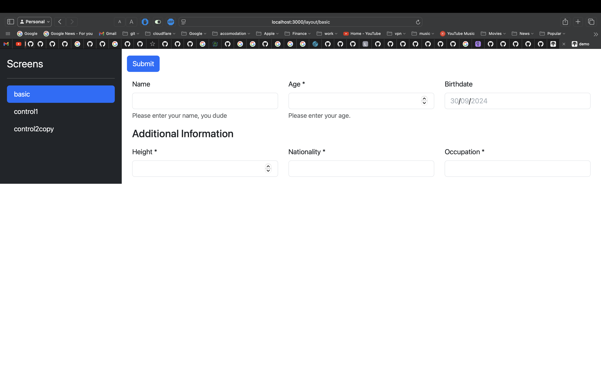
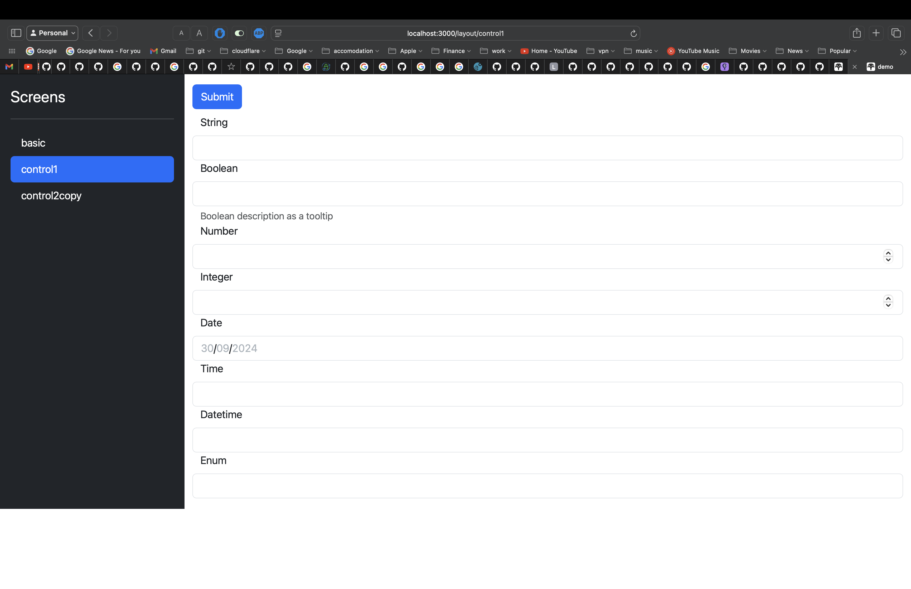
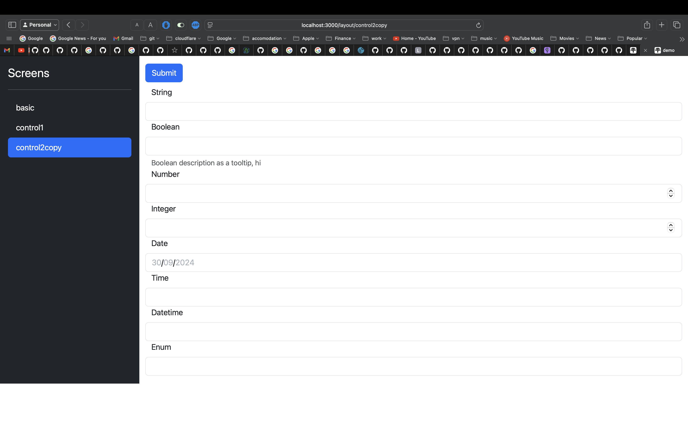

# Naked HTMX

This is a golang, HTMX based implementation of Naked Objects.

https://en.wikipedia.org/wiki/Naked_objects exposes the objects, like struts or DB rows directly to the GUI.

https://htmx.org is a simple way to build interactive web sites.

We are using latest htmx: https://unpkg.com/htmx.org@2.0.2








## Status

It works now.

```sh 

# http://localhost:3000
go run cmd/main.go

```

## How ?

Using HTMX, this package reads the JSON Schema to describe your data structure and validation rules, and another JSON Schema to describe the GUI widgets, and then renders the HTML with full data validation using HTMX.

There are 3 examples in the **screens** folder. Here is what **control1** looks like.

The DATA description:

```json

{
  "type": "object",
  "properties": {
    "string": {
      "type": "string"
    },
    "boolean": {
      "type": "boolean",
      "description": "Boolean description as a tooltip"
    },
    "number": {
      "type": "number"
    },
    "integer": {
      "type": "integer"
    },
    "date": {
      "type": "string",
      "format": "date"
    },
    "time": {
      "type": "string",
      "format": "time"
    },
    "dateTime": {
      "type": "string",
      "format": "date-time"
    },
    "enum": {
      "type": "string",
      "enum": [
        "One",
        "Two",
        "Three"
      ]
    }
  }
}

```

The GUI Description:

```json
{
  "type": "VerticalLayout",
  "elements": [
    {
      "type": "Control",
      "scope": "#/properties/string"
    },
    {
      "type": "Control",
      "scope": "#/properties/boolean"
    },
    {
      "type": "Control",
      "scope": "#/properties/number"
    },
    {
      "type": "Control",
      "scope": "#/properties/integer"
    },
    {
      "type": "Control",
      "scope": "#/properties/date"
    },
    {
      "type": "Control",
      "scope": "#/properties/time"
    },
    {
      "type": "Control",
      "scope": "#/properties/dateTime"
    },
    {
      "type": "Control",
      "scope": "#/properties/enum"
    }
  ]
}

```


## Look and Feel

The UI Look and feel is easily changeable.

Layout using the standard golang HTMX structure as seen in this repo, where you have the layout and page archetypes.

Look using any GUI toolkit, such as **UIKIT**, works fine with 2 javascript head imports. https://getuikit.com/docs/installation#download

## Screen types

The classic Master / Detail Pattern is everywhere. https://en.wikipedia.org/wiki/Master–detail_interface

You al know it intuitively...Its the boring stuff...

1. Master is a list of rows in the DB, typically with a search form above it, to paginate through it.
2. Detail is a single row, where you can edit the data.

Master Page is to be added.

## Workflows

Cross Form Validation, for when you filling out a form where one forms data is dependent on another forms data is easy since the GUI is directly driven by the DB, and your saving to the DB when you you submit and move on to the next form.

However, for very complex use cases, the user changes some data on Form 2, that is related to Form 1, we need to navigate them back to Form 1.

This wil be added using Event Choreography pattern for loose decoupling, so that any complex form dependencies can be achieved.

## DB following

So when your DB structure changes, the GUI changes with it automatically in real time.

The JSON Schema and GUI JSON SCHEMA being generated at runtime based on sensible reflection logic.


## Data Schema Providers

Hook up using the Provider pattern for other storage Archetypes.

Candidates are:

AnyQuery ( https://github.com/julien040/anyquery )

Conduit ( https://github.com/ConduitIO ) 

Peerdb ( https://github.com/PeerDB-io/peerdb )

## Data Sync across forms

Real time, matching of the underlying DB to the GUI is a work in progress.

Then we can built providers for different Storage systems and reflect off them at runtime; Schema CDC essentially.

Data CDC will be added using SSE and NATS, so that all users screens update in real time as one users changes a field.

A Real Time Collaborative example is the Todo demo at https://data-star.dev, but without all the code, https://github.com/delaneyj/datastar/blob/main/backends/go/site/routes_home.go, because Naked HTMX is reflective and so will not need all that code.


## Generation or Refection at Design Time or Runtime ?

Take your pick..

This is 100% reflection based, and so can be changed at runtime.

Generate the JSONSchema at Runtime or Design time ( aka code gen ) as the DB structure changes too, which is nice.

You can also move the "compute to the data" at runtime with WASM, using Compiler as a Service patterns.

This will run just fine as WASM on the Server or Clients, allowing HTMX to be used in either place.
Feed your DB schema changes as JSON to the WASM GUI, or some other thing you want.

Kind of almost a Low code, no code platform then. 

## CQRS / Event Sourced

Because the GUI is a direct representation of the Data, you may want to use this in a CQRS style Architecture, where the Read and Write side have different data structures.

In which case, the **NAKED HTMX** GUI is using the READ side DB, with changes send to the Write side as an Event.

This allows Event sourced Architectures with the Mutations ( the Write side of CQRS ) being described by JSON Schema, and the View ( the read side of the CQRS ) being also described by JSON Schema. 

You could, for example, use this with Pocketbase. Pocketbase is a Read side CQRS (NewSQL de-normalized structure).
It itself fire events, that could be directed into any Event Transform system.

Events feeding into Benthos is a good way to do this at runtime, as is NATS Jetstream. I use both in combination.

https://docs.redpanda.com/redpanda-connect/components/processors/json_schema/

https://github.com/nats-io/jsm.go/blob/main/schema_source/definitions.json

This gives you an OLTP and OLAP in one system also. You can do pretty much any sort of Project with it.


```json
{
	"$id": "https://example.com/person.schema.json",
	"$schema": "http://json-schema.org/draft-07/schema#",
	"title": "Person",
	"type": "object",
	"properties": {
	  "firstName": {
		"type": "string",
		"description": "The person's first name."
	  },
	  "lastName": {
		"type": "string",
		"description": "The person's last name."
	  },
	  "age": {
		"description": "Age in years which must be equal to or greater than zero.",
		"type": "integer",
		"minimum": 0
	  }
	}
}
```

## Deno, Bun, Nodejs

Will wrap with **deno2** for JS developers since you will not need golang to run and change it, since the system is self reflective. 

## NATS Evolution

Enable to reflect off NATS and configure NATS at runtime based on your Event and DB structure, allowing real time stream evolution over SQL migrations.

## Config

A system like this really wants a reactive parametric configuration system.

**koanf** has the underlying design to do this with NATS.

https://github.com/knadh/koanf/issues/310#issuecomment-2382158165 


